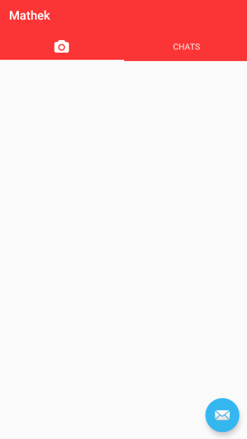

# Android-Chat-Application (Java, Android Studio, Firebase)
### Above is all the Java code I implemented for this application in AndroidStudio, and below is a description of my project
-	Developed and published android app on Google Play Store that allows users to chat with each other 
-	Created a method for users to efficiently communicate mathematics by implementing LaTeX into text
-	Implemented Firebase (authorization, databases), and designed User Interface 

